# ПРОЕКТ СИСТЕМА ЗА РЕЗЕРВАЦИЯ НА ЕКСКУРЗИИ

## Описание на задачата

### Цел на проекта:
Да се разработи система за резервации на екскурзии и туристи, използвайки Spring Boot. Системата трябва да предоставя REST API, което ще позволява управление на турове, потребители, резервации и списъци с любими дестинации.

---

## Основни функционалности

### 1. Потребители

Роли:
* **Traveler (Пътешественик):**
  * Може да разглежда турове.
  * Може да резервира турове.
  * Може да добавя турове в списък "Любими".
  * Може да разглежда списък с направените си резервации.
  * Може да управлява профила си.

* **Guide (Екскурзовод):**
  * Управлява туровете (създава, редактира, изтрива).
  * Може да разглежда туровете, които е създал.
  * Може да управлява профила си.
  * Не може да прави резервации за турове.

* **Admin (Администратор):**
  * Има достъп до **Admin Dashboard**.
  * Може да разглежда и изтрива всички потребители в системата.
  * Може да разглежда и изтрива всички турове.
  * Не може да прави резервации за турове.

### 2. Турове (Tours)
Туровете могат да имат:
* Едно основно изображение (URL).
* Множество резервации (One-to-Many).
* Локация, цена, продължителност, описание и точка на среща (Meeting Point).
* Максимален брой участници (Max Group Size).

### 3. Резервации (Bookings)
* Представляват процеса на запазване на място в даден тур от потребителя за конкретни дати.
* Включват статуси и брой участници.

### 4. Любими турове (Favorites)
* Възможност потребителите да запазват турове за бъдещо разглеждане (Many-to-Many връзка между потребител и тур).

---

## Стъпки на разработка

1. **Проектиране на базата данни:**
   * Определяне на основните таблици и техните връзки.
   * Структура на базата данни е описана по-долу.

2. **Разработка на REST API:**
   * Управление на потребители (CRUD).
   * Управление на турове (CRUD).
   * Управление на резервации (CRUD).
   * Управление на любими турове.

3. **Внедряване на роли и сигурност:**
   * Дефиниране на роли (TRAVELER, GUIDE, ADMIN).
   * Ограничаване на достъпа до различни части на приложението чрез Spring Security.

4. **Изграждане на връзки между таблиците:**
   * Работа с One-to-Many и Many-to-Many връзки чрез Hibernate/JPA.

5. **Тестване на функционалностите:**
   * Проверка на API чрез Swagger (OpenAPI) или Postman.
   * Уверяване, че всички роли имат правилните права.

---

## Как да стартирате проекта локално

За да пуснете проекта на вашия компютър, следвайте тези стъпки:

### 1. Стартиране на базата данни (PostgreSQL)
Проектът използва Docker за лесно вдигане на базата данни. В главната директория на проекта отворете терминал и изпълнете:
```bash
docker-compose up -d
```
*Това ще стартира автоматично PostgreSQL контейнер на порт 5432.*

### 2. Стартиране на Spring Boot приложението
След като базата данни работи, стартирайте самия Spring сървър чрез Gradle. В терминала (от корена на проекта) изпълнете:

**За Windows:**
```cmd
gradlew bootRun
```

**За Mac/Linux:**
```bash
./gradlew bootRun
```
*Алтернативно, може просто да стартирате `TourReservationApplication.java` директно през бутона "Play" във вашата среда.*

### 3. Достъп до приложението
Когато сървърът зареди успешно, отворете вашия браузър на следния адрес:
 **http://localhost:8080/index.html**

---

## Тестване на системата

Преди да тествате API, **задължително се уверете, че Spring Boot приложението е стартирано**.

1. **HTTP API Тестове (`api-tests.http`):**  
   Отворете файла `api-tests.http` чрез вашата среда. Ще видите малки "Play" (Run) бутони до всяка заявка (GET, POST). Просто ги натиснете, за да изпратите заявка към работещия сървър.

---

## Сигурност и ограничения

1. **Роли:** Достъпът до API ресурсите е ограничен въз основа на ролята на потребителя (ADMIN, GUIDE, TRAVELER).
2. **Защита на Администратора:** Системата не позволява на администратор да изтрие самия себе си през интерфейса.
3. **Бизнес логика:**
   * Само потребители с роля `TRAVELER` могат да правят резервации.
   * Гидовете могат да редактират и изтриват само туровете, които те самите са създали.
   * Администраторите имат глобални права за модериране на съдържанието (изтриване на всякакъв тур или потребител).

---

## Технологичен стек

### Backend:
1. **Spring Boot Framework:**
   * **Spring Web:** За изграждане на RESTful API.
   * **Spring Data JPA:** За работа с релационна база данни чрез Hibernate.
   * **Spring Security:** За аутентикация, оторизация и защита на ресурсите.
2. **PostgreSQL:** Мощна релационна база данни за надеждно съхранение на информацията.
3. **Docker:** Платформа за контейнеризация, използвана за лесно стартиране на базата данни и други зависимости.
4. **MapStruct:** За автоматизирано преобразуване на Entity обекти към DTO.
5. **Lombok:** За намаляване на boilerplate кода (getters, setters, builders).
6. **OpenAPI (Swagger):** Интегрирана документация на API-тата.

### Frontend:
1. **Vanilla JavaScript:** За динамично управление на съдържанието и Fetch API заявки.
2. **HTML5 & CSS3:** Модерен дизайн с CSS променливи, Flexbox и Grid.
3. **Google Fonts (Outfit):** За професионална типография.

---

## Дизайн на базата данни (Entity Model)

По-долу е представена Entity-Relationship (ER) диаграма, която визуализира структурата на базата данни:

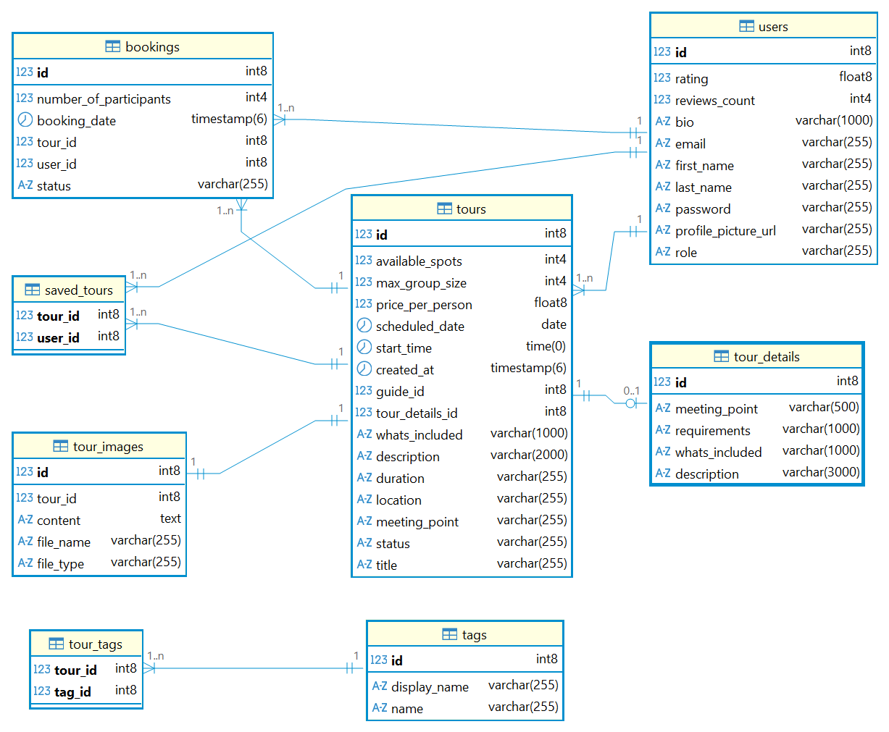

### Основни таблици:

1. **Users**
   * `id`, `email` (unique), `first_name`, `last_name`, `password`, `role` (ADMIN, GUIDE, TRAVELER), `bio`, `rating`.
2. **Tours**
   * `id`, `title`, `description`, `location`, `duration`, `price_per_person`, `max_group_size`, `available_spots`, `meeting_point`, `scheduled_date`, `start_time`, `status`, `created_at`, `guide_id` (FK).
3. **Bookings**
   * `id`, `user_id` (FK), `tour_id` (FK), `participants`, `status`, `total_price`, `booking_date`.
4. **Tour Image** *(OneToOne - всеки тур има точно една снимка)*
   * `id`, `tour_id` (FK, unique), `file_name`, `file_type`, `content` (URL на снимката).
5. **Saved Tours / Favorites** *(ManyToMany join table)*
   * `user_id`, `tour_id` - свързва потребители с любими турове.

### Релации:
| Тип | От | Към |
|---|---|---|
| OneToOne | Tour | TourImage |
| OneToMany | Tour | Booking |
| ManyToMany | User | Tour (Favorites) |
| ManyToOne | Tour | User (Guide) |

---

## Документация на API (Swagger)

Приложението включва вградена **Swagger** документация. След стартиране на сървъра, можете да разгледате всички налични ендпойнтове, техните параметри и очаквани отговори на адрес:
`http://localhost:8080/swagger-ui.html`

---

## Фронтенд и Потребителски Интерфейс (Screenshots)

Тази секция представя визуалното оформление на страниците и техните възможности. След стартиране на приложението, може да направите скрийншоти и да замените примерните пътища по-долу с реалните файлове.

### 1. Начална страница (Home Page)
Началната страница посреща потребителите с динамичен списък от всички налични туристически пакети. За всеки тур се показва локация, продължителност, цена и брой оставащи места както и бутон за разглеждане на детайли.

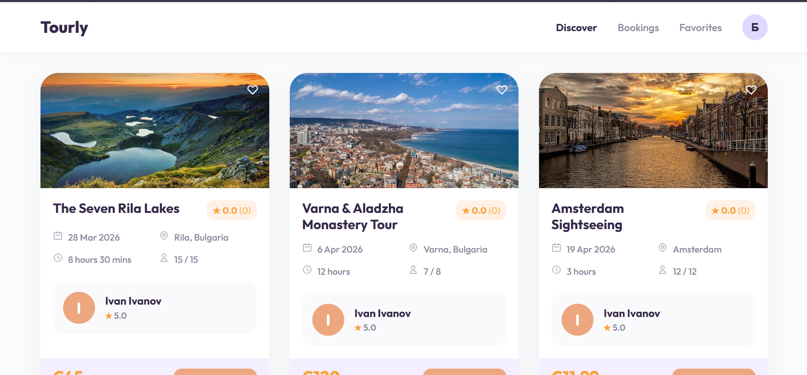

### 2. Вход (Login)
Формата за вход позволява на потребителите да влязат в профила си.

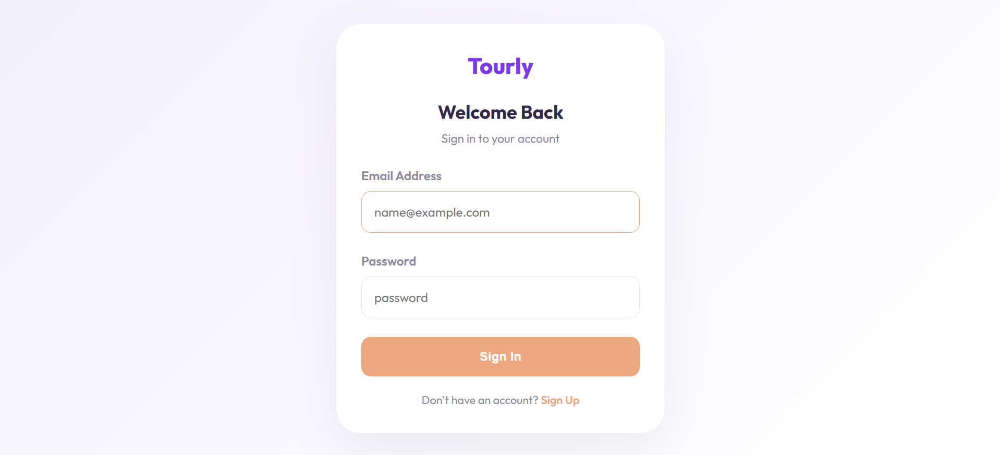

### 3. Регистрация (Sign Up)
Формата за регистрация позволява на потребителите да си създадат профил. При регистрацията се избира роля (Traveler или Guide), което отключва различна функционалност.

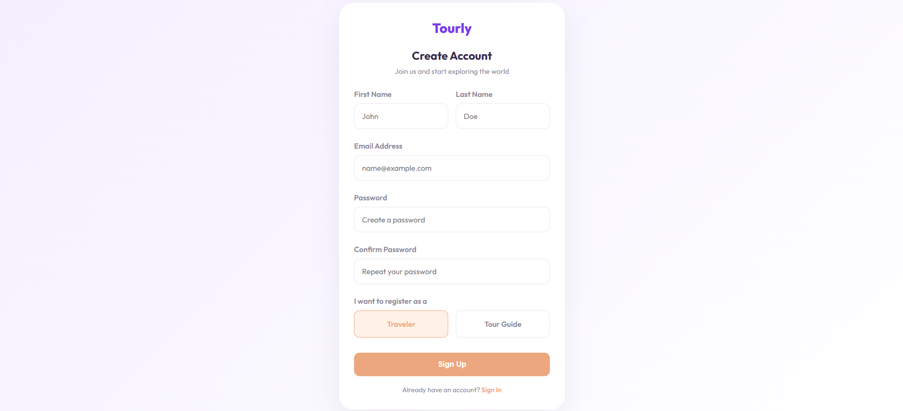

### 4. Детайли за тур (Tour Details)
Тук се предоставя изчерпателна информация за избраната екскурзия – дата и час, точка на среща, оставащи места, локация, времетраене, пълна информация и бутон за добавяне в любими. Само потребители с роля Traveler имат достъп до формата за резервация.

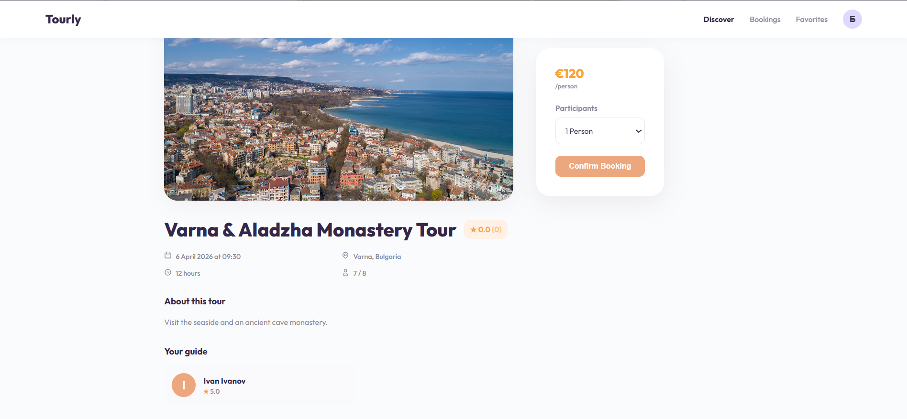

### 5. Моите резервации (My Bookings)
Списък, от който Пътешественикът (Traveler) проследява направените резервации. Показва се датата на запазване, броя участници и общата сума, както и бутон за анулиране на резервацията.

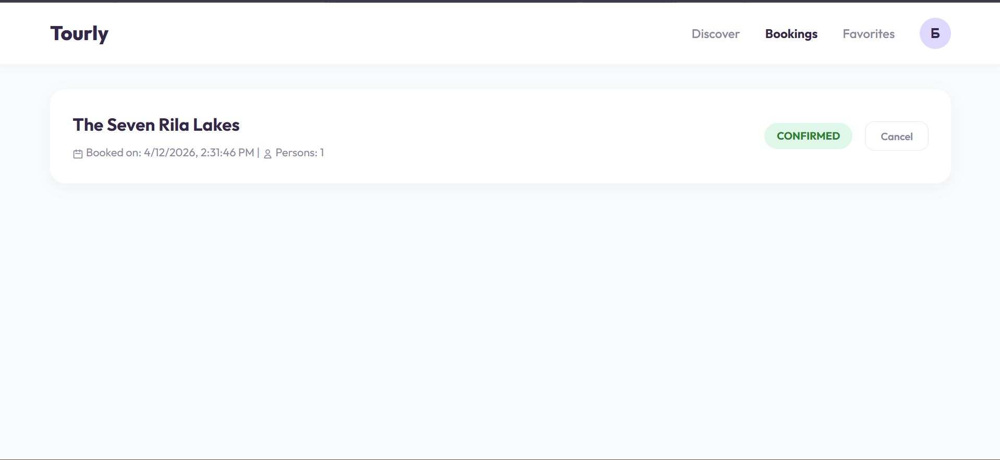

### 6. Любими турове (Favorites)
Ако даден потребител е харесал тур, но все още не е готов да резервира, той може да го запази тук за по-късно.

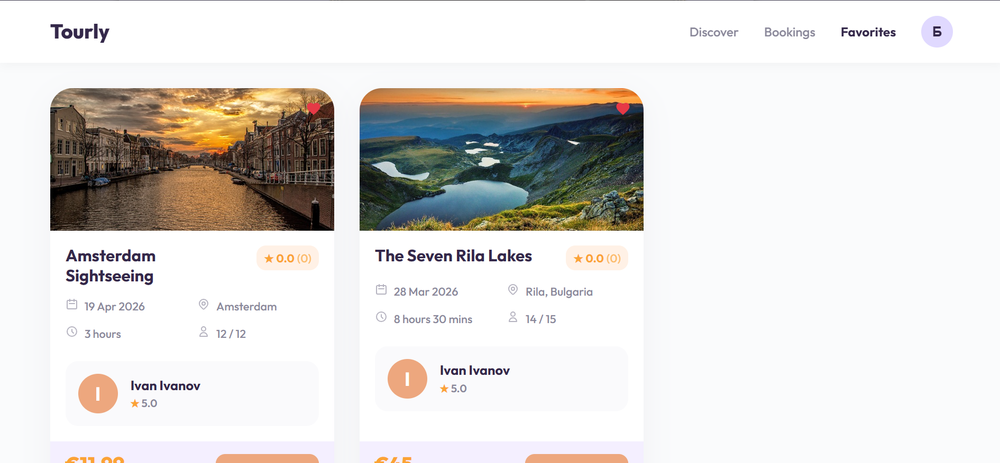

### 7. Моите Турове (My Tours) - *за Guide*
Табела за управление, достъпна само за екскурзоводи (Guide). Тук са създадените от тях турове и се предоставя функционалност за лесна редакция или изтриване.

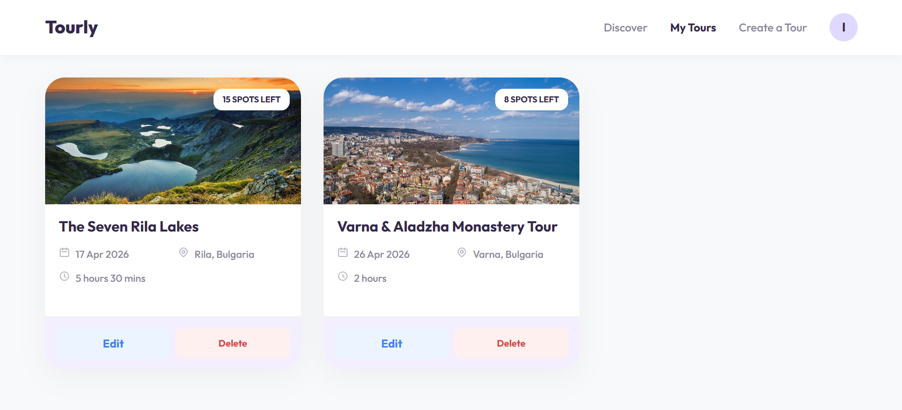

### 8. Създаване на тур (Create Tour) - *за Guide*
Интуитивна форма, където гидът попълва необходимите данни за нов тур. Данните се изпращат към REST API-то на Spring приложението.

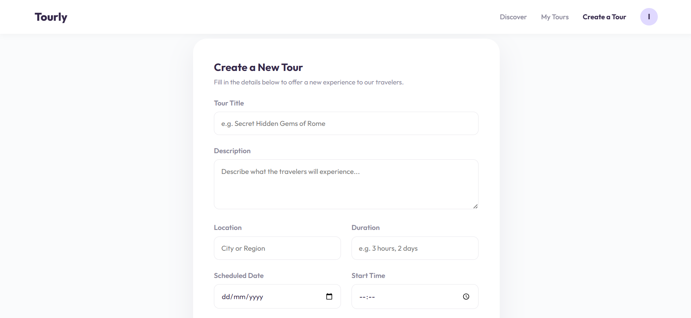

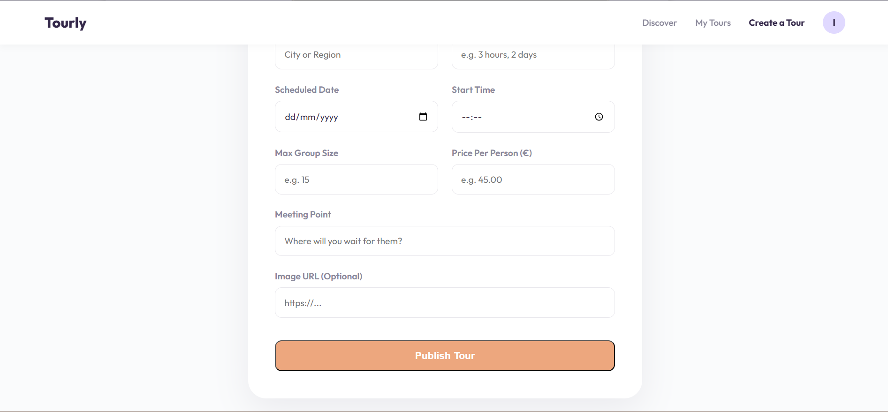

### 9. Моят Профил (Profile)
Страница, показваща личните данни на потребителя с опции за редакция на информацията, както и излизане от системата и изтриване на профила.

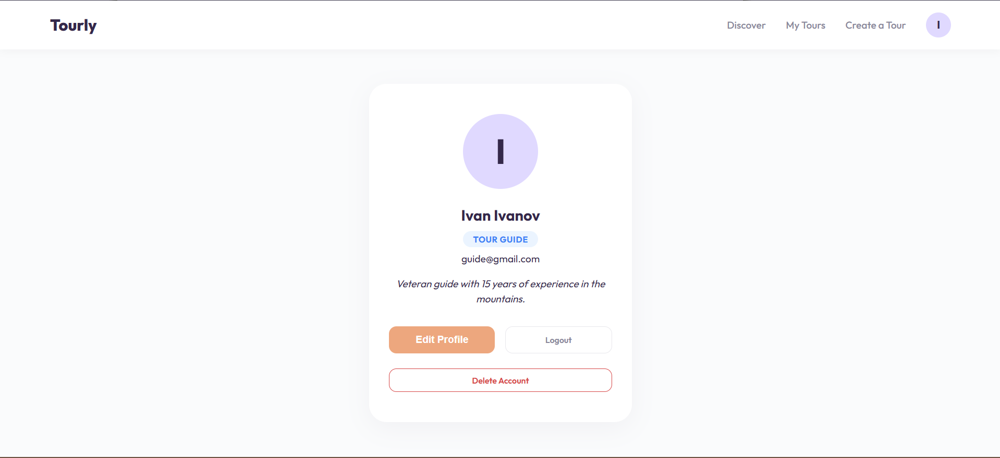

### 10. Админ Панел (Admin Panel)
Централизирано табло, достъпно само за администратори, с два бързи линка към подстраниците за управление.

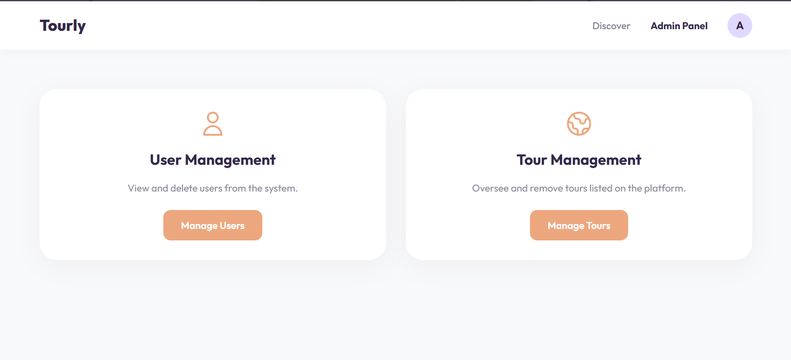

### 11. Управление на потребители (User Management) - *за Admin*
Таблица с всички регистрирани потребители в системата. Показва три-цветен badge за ролята (Admin / Guide / Traveler) и бутон за изтриване на всеки потребител. Собственият профил на администратора е защитен - до него бутонът е деактивиран.

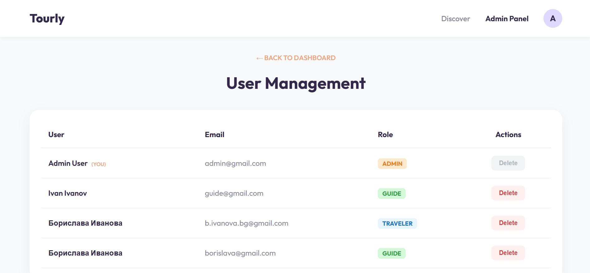

### 12. Управление на турове (Tour Management) - *за Admin*
Таблица с всички налични турове в платформата. Показва заглавие, локация, гид и цена за всеки тур. Администраторът може да изтрие произволен тур от системата, независимо кой гид го е създал.

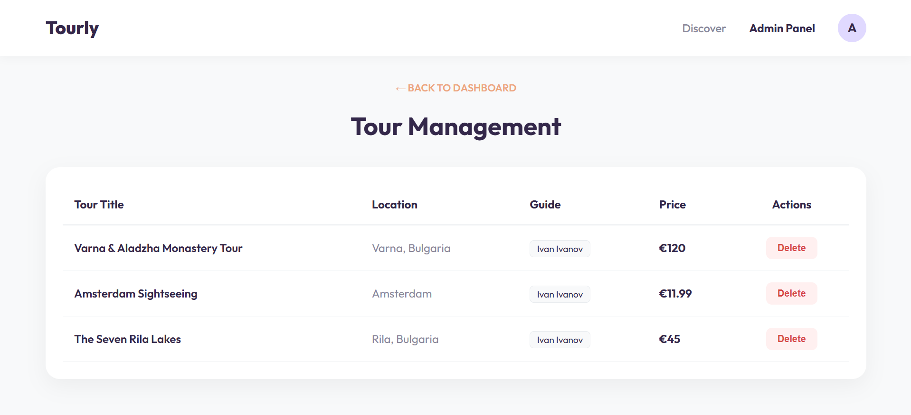

---

## Аутентикация и Тестови данни

За целите на тестването и локалната разработка, системата автоматично сийдва (зарежда) следните тестови потребители:

### 1. Администратор:
* **Email:** `admin@gmail.com`
* **Парола:** `admin123`
* **Роля:** `ADMIN`
* **Възможности:** Управление на потребители и изтриване на всички турове през Admin Dashboard.

### 2. Екскурзовод (Guide):
* **Email:** `guide@gmail.com`
* **Парола:** `secret123`
* **Роля:** `GUIDE`
* **Възможности:** Създаване, редактиране и изтриване на собствени турове в секция "My Tours".

### 3. Пътешественик (Traveler):
* Можете да регистрирате нов профил с роля `TRAVELER` през формата за регистрация, за да правите резервации и да добавяте в "Любими".
